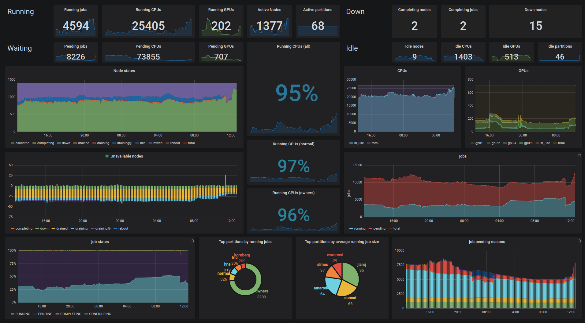
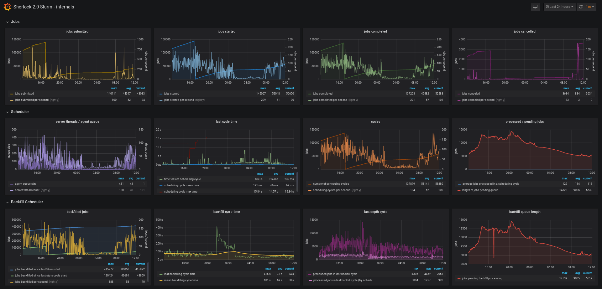

# HPC Dashboards

This repository contains a few examples of the HPC monitoring dashboards
developed at [SRCC](http://srcc.stanford.edu).

**IMPORTANT**: those are just raw scripts and examples that cannot be used
as-is. They're meant as a way to provide some inspiration and examples, but are
absolutely not a ready-to-use solution.

## Monitoring infrastructure

The data collection scripts and dashboards in this repository have been
developed in the following context:

1. data collection scripts run on a regular schedule (through `cron`, for
   instance).

2. they collect metrics from a given subsystem and format them in
   [Graphite](https://graphiteapp.org/)'s [plaintext data
   protocol](https://graphite.readthedocs.io/en/latest/feeding-carbon.html#the-plaintext-protocol): 
   `<metric path> <metric value> <metric timestamp>`
3. the data is then sent to Graphite with something as sophisticated as: 
   `./script | nc http://$GRAPHITE_HOST $GRAPHITE_PORT`
4. a [Grafana](https://grafana.org) instance gets data from the Graphite
   server, and displays the dashboards.

Data collection scripts can be written in any language (we love Bash and
Python), but there's really no constraint on what language can be used, as long
as it can output strings on the console.

Dashboards are provided here in JSON format and can be [imported into
Grafana](https://grafana.com/docs/reference/export_import/#importing-a-dashboard)

## [Slurm](https://slurm.schedmd.com/overview.html)

The `sched/slurm` directory contains:
- the data collection script (`slurm.py`) that will call `squeue`, `sinfo`,
  `sdiag`...) to gather the scheduler information,
- the `slurm_overview.json` and `slurm_internals.json` dashboards that can be
  directly imported into Grafana.

**Slurm overview**

**Slurm internals**

